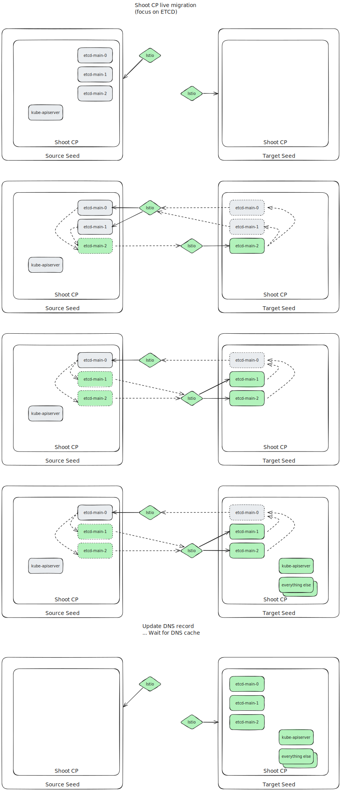

# Shoot Control-Plane live migration

## Things we've achieved
- ✅ Try setting hostnames in pod spec instead of coredns config, see [hosts file](./examples/dnsoverride.txt)
  - Instead we could try external names and point them to the etcd
  - Will result in multiple rollouts of etcd sts
  - HostAliases are working! see [etcd statefulset](./examples/sts-etcd.yaml)
  - ExternalNames aren't a really useful solution
  - If we don't want to roll etcds we could use [headless svc](./examples/headless-svc.yaml) without selector and manually managed [endpoints](./examples/endpoints.yaml),
    afterwards we can add a selector
  - Maybe hostAliases are still better because we ensure that the etcd pod dns caches have the new IPs. (likely not the case)
- ✅ Try replacing [LBs](./examples/lb.yaml) with [istio](./examples/istio.yaml)
  - Needs additional port(s) to be added to istio LB svc.
  - Or some overlay network (tailscale). Via additional istio gateways is enough!
- ✅ utilize k8s 1.26 feature (sts start index), don't deploy "migrate" sts just scale the normal sts differently
  - this feature (`spec.ordinals.start`)` is enabled per default since 1.27 and works as expected
  - ordinal.start=2 and replicas=1 results in one pod named: "stsname-2"
  - ordinal.start=1 and replicas=2 resutls in two pods: "stsname-1, stsname-2" (2 isn't recreated!)
  - this theoretically allows to do something like this:
    1. Scale source etcd to 2 & scale target to 1 (start=2)
    2. Scale source etcd to 1 & scale target to 2 (start=1)
    3. Migrate DNS record
    4. Scale source etcd to 0 & scale target to 3 (start=0 default)
- ✅ do we need to expose both 2379 and 2380 or just 2380?
  - 2380 is enough

## Things we still need to try/find out:

Things to try/find out:

- How to handle VPN (regarding webhooks, etc.) "migration" (do we want real zero downtime or just a shorter downtime)

- How will CP migration work (two seeds need to do things at the same time)
  - how to handle migration of extensions
  - how to copy resources (secrets, MRs, etc.)
  - can we start the entire controlplane on the target seed while the "old" is still running.
    - if leader election for controlplane controllers is handled via shoot apiserver we are fine
    - if leader election leases are stored in the seed kube-apiserver we have a problem
  - already implemented "frickel" prototype:
    - source seeds stores shootstate to vgarden
    - target seeds waits for existence of shootstate, once existing start applying first things

- If our proposed way of migrating CPs should be the new "default", we still should be able to migrate non HA-Shoots.
  But the "live"-cp migration requires (currently) at least HA etcd,
  therefore we need to be able to scale the etcd cluster back to one replica after the migration.

Next "steps":
- check controllers running in shoot cp for leases & things they store in the seed apiserver
- (maybe) code bare-bones migration flow

- add sts ordinal.start field to etcd API ;) (etcd-druid)

## Next steps

Discuss this idea with people who actually know what they are doing about, as we've made a lot of assumptions of how ETCD and the control-plane migration is working

## Code we've touched
- [etcd-druid](https://github.com/Kumm-Kai/etcd-druid/tree/hackathon)
- [gardener](https://github.com/Kumm-Kai/gardener/tree/hackathon)
